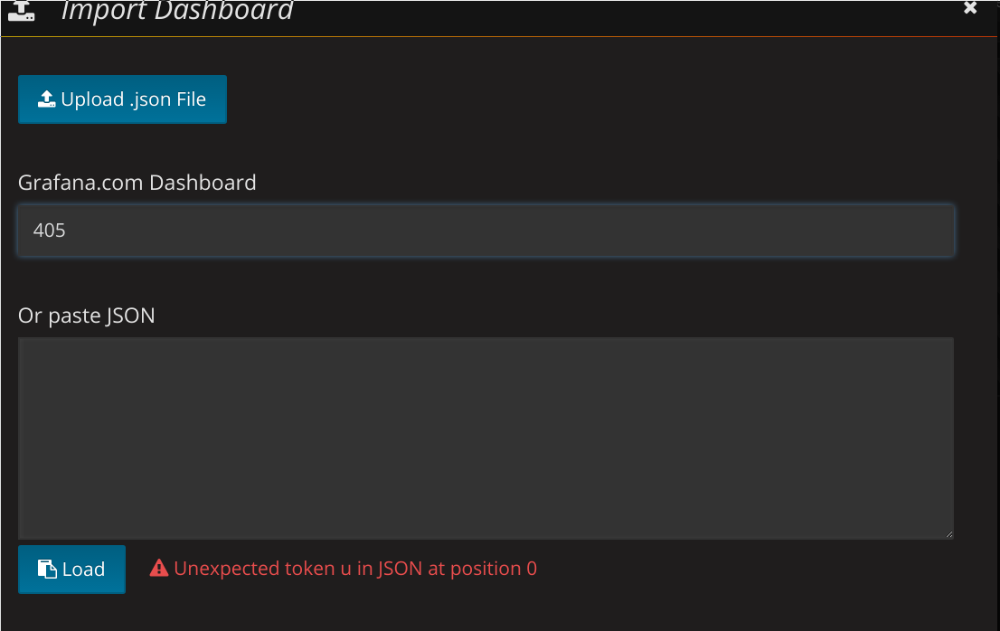
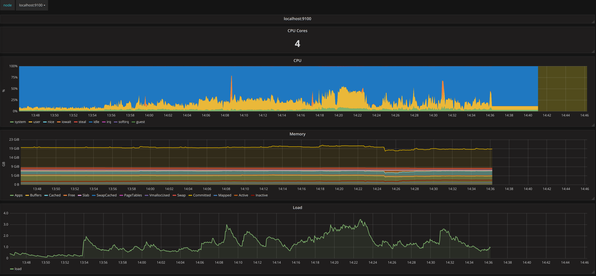
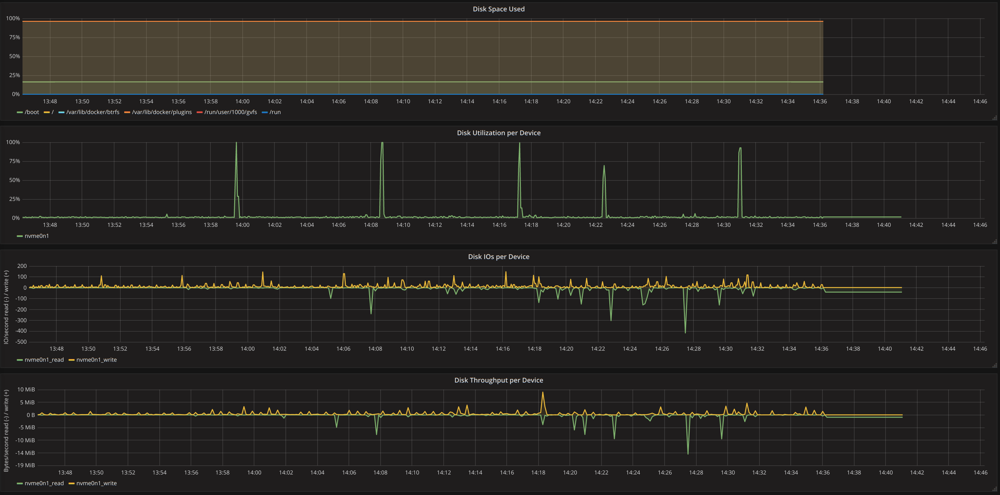
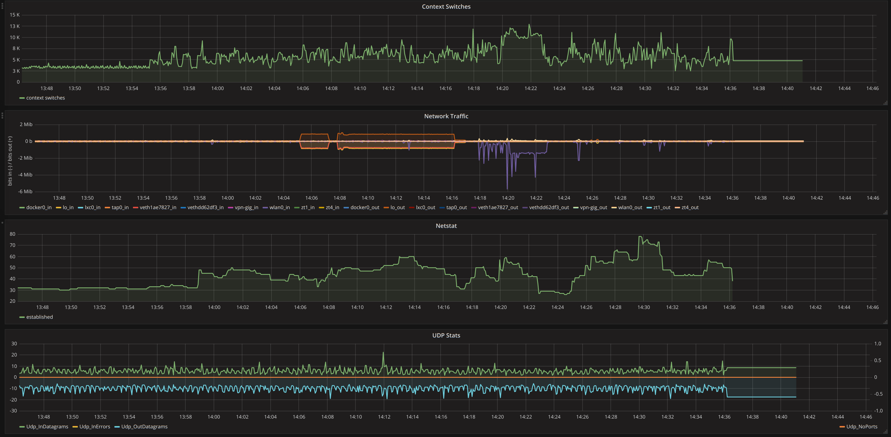
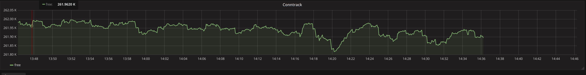

# Monitor the system of a node

Prometheus comes with a lot of pre-made exporter. One of them is the [node_exporter](https://github.com/prometheus/node_exporter), it's design to monitor the system of a node (CPU, disk, memory, IOPS, networks....)

In this POC, I'll explain how to setup this exporter and visualize the result in grafana.

- First, install the node_exporter:
```
go get github.com/prometheus/node_exporter
cd ${GOPATH-$HOME/go}/src/github.com/prometheus/node_exporter
make
./node_exporter <flags>
```

- Start the node exporter on the local machine. Just execute the binary `./node_exporter`

- Add a configuration to prometheus to tell him to start scrapping the node exported. Add this target to your prometheus config, then restart prometheus.
```yaml
scrape_configs:
  # The job name is added as a label `job=<job_name>` to any timeseries scraped from
  - job_name: 'system'
    static_configs:
      - targets: ['localhost:9100']
```

- If you don't have grafana installed, you can quicly get one using docker: ` docker run -d --name=grafana -p 3000:3000 grafana/grafana`

- Login into grafana at `localhost:3000`, credentials are `admin/admin`
- Lucky for us it already exists a dashboard that consume the data produce by the node exported. In grafana click on import dashboard, put 405 in the input for Grafana.com Dashbaord then click `load` :


- Your done, the dashbaord is installed and you can start exploring your data.

Screenshot of the dashbaord:



